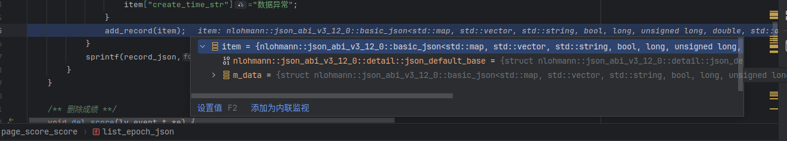
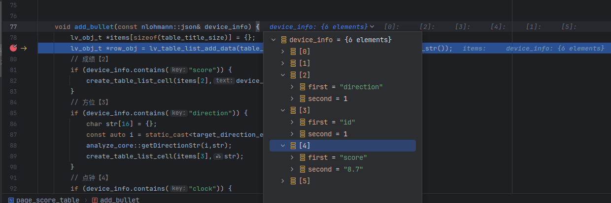

# 配置Clion的 nlohmann_json 
为什么要配置这个库?

显然配置前是这个样子的,很难排查json里面有什么内容


## 开始配置
我的Cmake项目外部库模块在components
其中 nlohmann_json 是 git clone 的
```shell
git clone https://github.com/nlohmann/json.git
```

那么在 目录里会有这么一个文件,这个文件是GDB调试器的脚本

components/nlohmann_json/tools/gdb_pretty_printer/nlohmann-json.py

在项目根目录创建.gdbinit文件，添加：
```shell
source components/nlohmann_json/tools/gdb_pretty_printer/nlohmann-json.py
# 设置打印选项
set print pretty on
set print object on
set print array on
```
如果你没有配置过`~/.gdbinit` 启动会出错,提示不安全
追加全局设置为安全路径
```shell
echo "set auto-load safe-path /" >> ~/.gdbinit
```
再次启动调试即可


