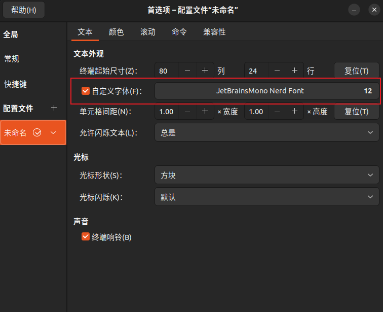
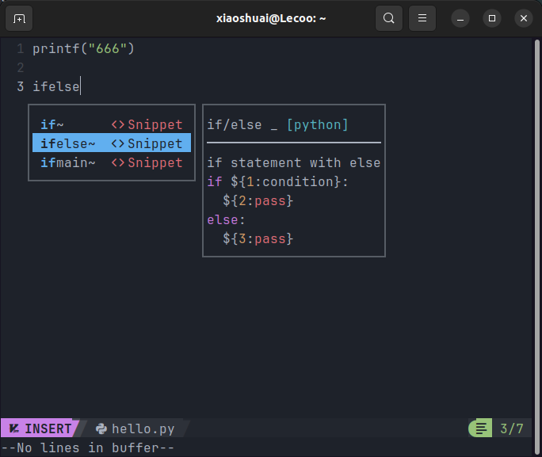

# nvim 编辑器

最近想尝试用一下 nvim，我的操作系统是 Ubuntu24
## 提前安装好：
一个带有 npm 的 nodejs 环境
Nerd 字体，并将你的终端字体设置成 Nerd 字体

我用的是 JetBrains Mono ，如果你安装过 Nerd Font 跳过这个步骤
```shell
# 下载 JetBrainsMono Nerd Font 压缩包
curl -OL https://github.com/ryanoasis/nerd-fonts/releases/latest/download/JetBrainsMono.tar.xz
# 创建用户字体目录
mkdir -p ~/.local/share/fonts/JetBrainsMono
# 解压下载的压缩包到字体目录
tar -xf JetBrainsMono.tar.xz -C ~/.local/share/fonts/JetBrainsMono
# 更新系统字体缓存
fc-cache -fv
# （可选）删除下载的压缩包
rm -f JetBrainsMono.tar.xz
# 验证安装（查看是否能识别到字体，输出包含 "JetBrainsMono Nerd Font" 即成功）
fc-list | grep -i "jetbrainsmono nerd"
```
::: info
安装完成字体之后要设置自己的终端字体为 JetBrainsMono Nerd Font Mono
:::

## 安装 nvim
我常试过使用 apt 安装，但是我安装的总是有问题。先说怎么安装，后面再说踩到的坑。
我现在用的是 appimage 版本的，下载地址

https://github.com/neovim/neovim/releases
我下载到了～/Applications 目录，根据自己喜好设置【2025 年 9 月 5 日 22:18:09】
```shell
cd ~/Applications
wget https://github.com/neovim/neovim/releases/download/nightly/nvim-linux-x86_64.tar.gz
tar xzvf nvim-linux-x86_64.tar.gz
# 然后修改 ./bashrc 添加一个启动方式
echo "alias nvim='~/Applications/nvim-linux-x86_64/bin/nvim'" >> ~/.bashrc
source ~/.bashrc
```

之后就可以命令行使用 nvim 了
## 使用 NvChad
这里有安装教程：
https://nvchad.com/docs/quickstart/install

这里我复制出来了，一个命令即可【2025 年 9 月 5 日 17:44:39】
```shell
git clone https://github.com/NvChad/starter ~/.config/nvim && nvim
```
回车之后就会安装了，会略微卡几秒钟 不要慌
先体验一下试试

目前到这里了，后面更新。。。 还再学，先记录一点【2025 年 9 月 5 日 17:50:53】